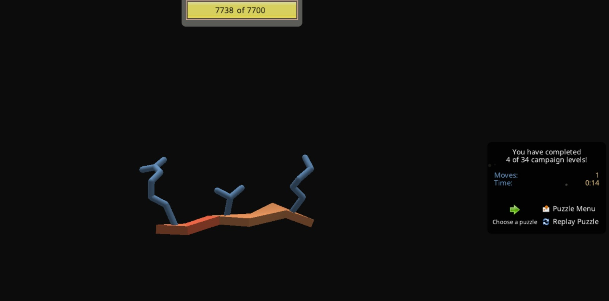
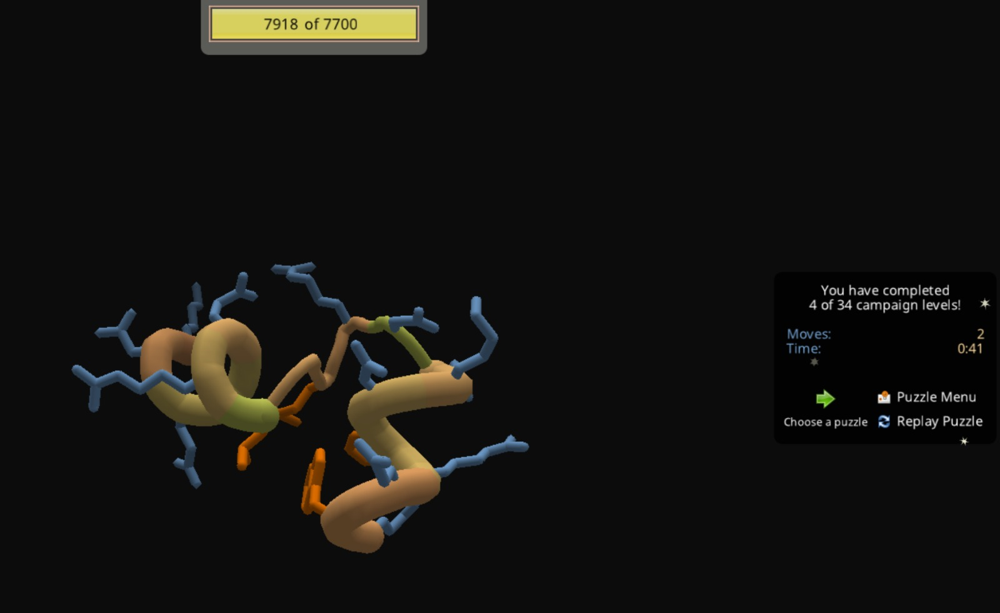
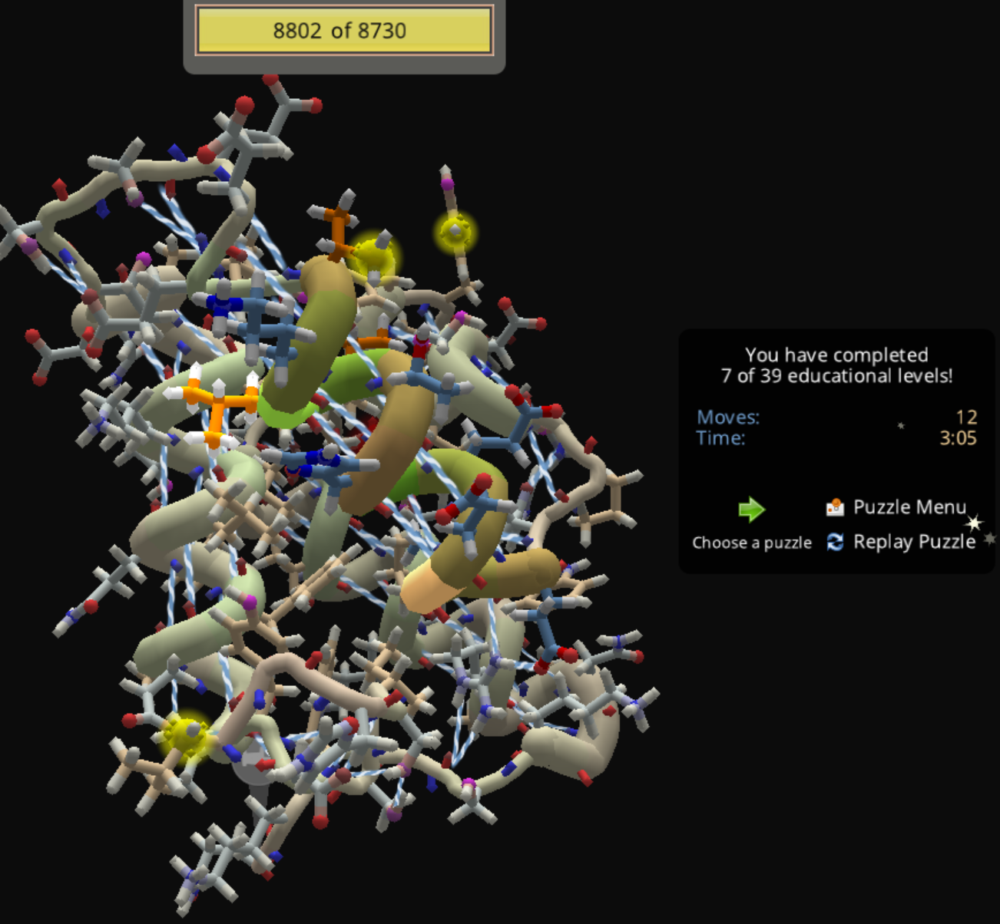
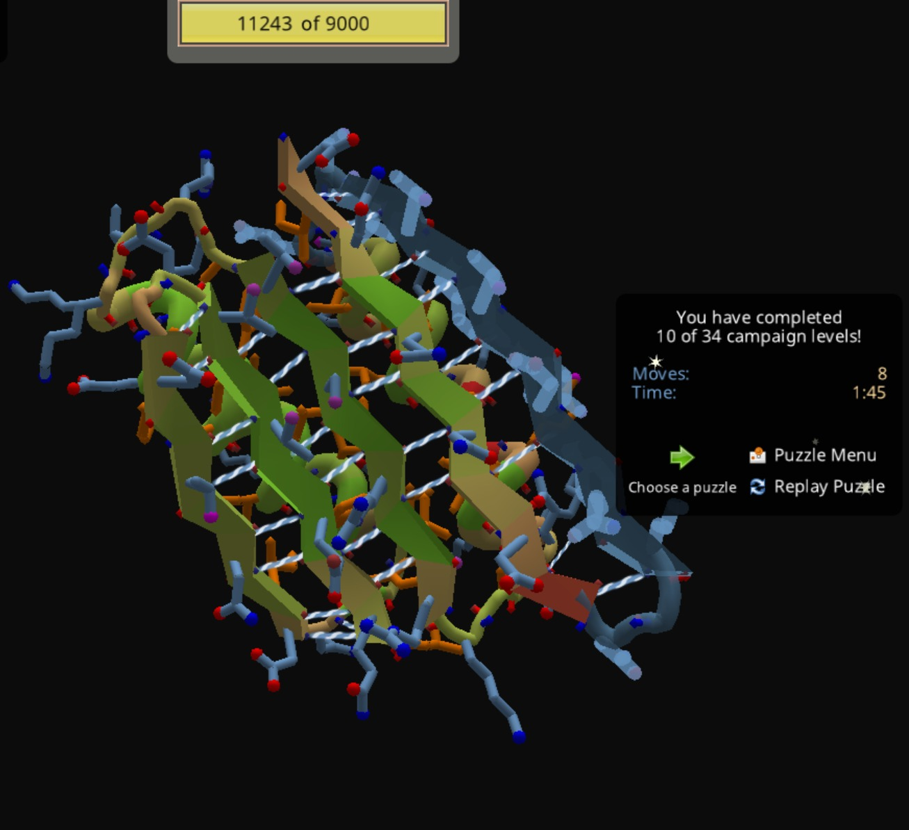
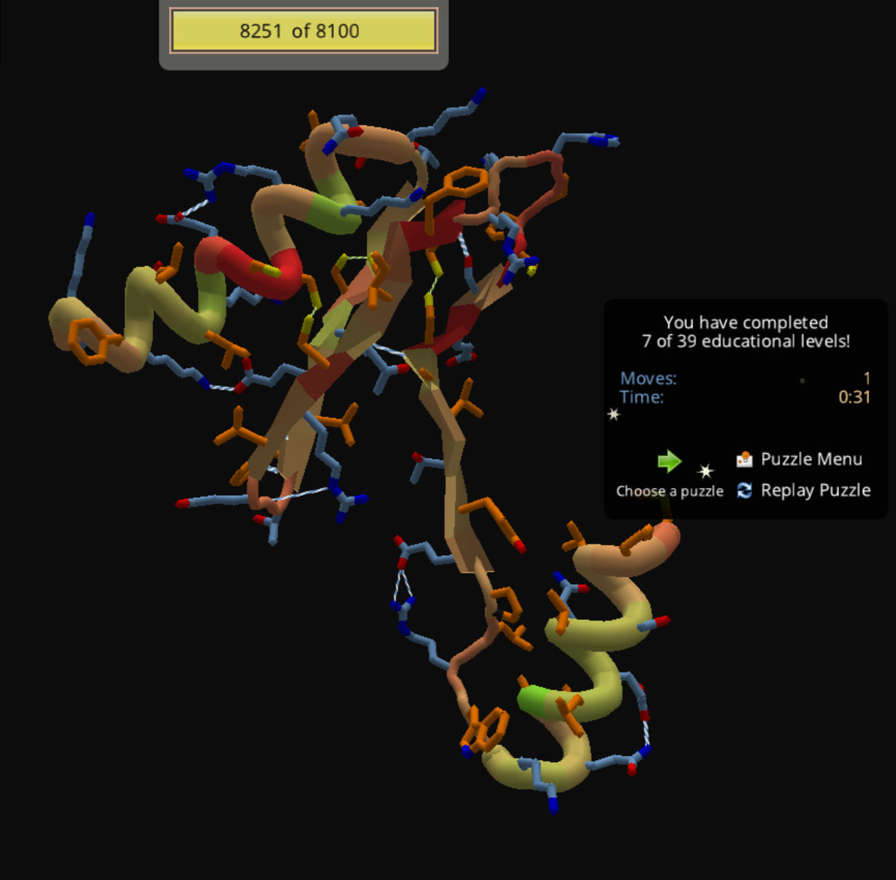
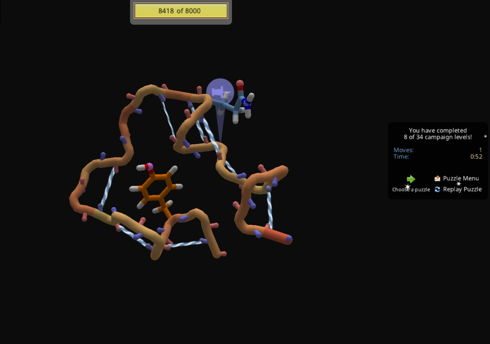
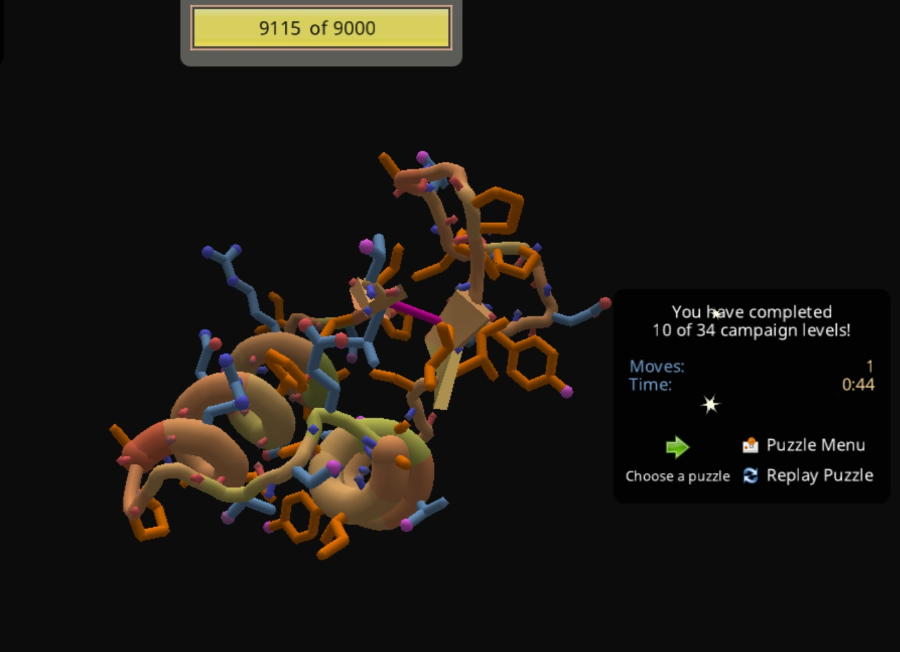

## FoldIt

[Foldit](https://fold.it/) es un software creado como un juego de plegamiento de proteínas cuyo objetivo es contribuir al aprendizaje y desarrollo de la ciencia detrás de los péptidos. Su interfaz plantea un modo interactivo en el que puedes aprender cómo los péptidos adquieren estructura en 3 dimensiones a partir de un esqueleto peptídico conformado por los 20 aminoácidos.

### Intro y estructura

La curva de aprendizaje de Foldit se centra en entender los principios detrás del por qué de las estructuras que adquieren las proteínas, inicialmente explicando cómo la interacción electrostática entre átomos que no conforman enlaces se repelen creando colisiones.  

Fig1. Nivel primario de Foldit

Foldit maneja un sistema de puntaje basado en la estructura que se está modelando en el juego, representado como esta barra de progreso en la parte superior. Esta indica la valoración del plegamiento de tu proteína en tiempo real de acuerdo a un modelo termodinámico que evalúa la factibilidad de esta conformación de acuerdo a la información disponible en el saber científico de la proteómica.

### Hidrofobicidad

Así mismo, con el progreso del juego, se introducen conceptos importantes dentro del estado fisiológico de las proteínas, como la cualidad de, en su mayoría las proteínas globulares, formar un core hidrofóbico en el que los residuos con poca afinidad al agua por su baja polaridad residen en la parte interna de la proteína interactuando entre ellos por fuerzas hidrofóbicas producto de la presencia de un solvente polar en el interior, que fisiológicamente es el citosol con una gran cantidad de agua.

Fig 2. Shake! ejemplificando la orientación interna de los aminoácidos hidrofóbicos como el triptófano (color naranja)

En la Fig 2 podemos ver cómo los aminoácidos no polares (naranja) tienen una mejor estabilidad termodinámica en el interior del péptido que aquellos polares con afinidad al agua (azules).

### Estructura secundaria

Algo también muy importante en la comprensión de la estructura de las proteínas es la adopción de formas organizadas conocidas como estructura secundaria en la que interacciones no covalentes como los puentes de hidrógeno hacen posible la organización de una cadena peptídica en $\alpha$ hélices y hojas $\beta$ , estos ejemplos se pueden ver ejemplificados en los juegos interactivos de puentes de hidrógeno:

  
Fig 3. Puentes de hidrógeno en una alfa hélice (bastones blancos con líneas azules)

 
Fig 4. Puentes de hidrógeno en hojas $\beta$

### Puentes disulfuro

Otro de los factores más importantes a la hora de la estabilización de una proteína en su estructura tridimensional es la presencia de puentes disulfuro. Estos son las interacciones entre grupos tiol de aminoácidos como la cisteína que en un ambiente reductor se cataliza la transformación de 2 cisteínas a cistinas en la que los azufres se asocian, creando enlaces más fuertes que los puentes de hidrógeno y le brindan soporte a la estructura tridimensional de la proteína.

  
Fig 5. Puentes disulfuro en una estructura tridimensional de una proteína (bastones blancos con líneas amarillas )

### Mutaciones

Las mutaciones son eventos que ocurren en las secuencias de DNA que codifican para las proteínas que se modelan a través de Foldit, sin embargo como el objetivo de este juego no es realizar un modelo complejo de un organismo representando todo el dogma central de la biología molecular se pueden introducir mutaciones a aminoácidos específicos dentro de la estructura modelada, esto con el objetivo de crear nuevos puentes de hidrógeno para estabilizar la estructura, fortalecer el core hidrofóbico de la proteína o incluso evitar colisiones o impedimentos estéricos de la misma.

  
Fig 6. Introducción de una mutación a un aminoácido hidrofóbico (tirosina) en el core de una proteína.

### Mover, agitar y otras funciones de FoldIt

Adicionalmente a los cambios (mutaciones) que puede proveer Foldit existe la función de **mover** la proteína con la intención de crear variabilidad en la estructura que estás creando, lo que hace esto es realizar un movimiento aleatorio en los esqueletos de las cadenas proteicas que estás modelando y al igual que la función **shake** que realiza movimientos en las cadenas expuestas de aminoácidos, evitan quedarse atrapados en mínimos locales, estos movimientos en especial el de los esqueletos peptídicos están sujetos a otros elementos del juego llamados bandas que son conexiones que puedes hacer entre los mismos para dirigir este movimiento aleatorio hacia una posición de interés como juntar dos betas.

  
Figura 7. Uso de bandas (color rosa) y movimientos para acercar dos hojas $\beta$

### Conclusión

Foldit es un juego de modelamiento muy amigable que permite estudiar la dinámica de las proteínas a la hora de plegarse con un fondo de conocimiento científico comprobado, usando principios termodinámicos para calificar las soluciones que se les encuentran a las cadenas peptídicas, así mismo este cuenta con un gran repertorio de desafíos que no solo impulsan el conocimiento sino que también la investigación tratando de resolver estructuras de la mejor manera o en el diseño de binders para desarrollo de moléculas como binders antivirales.
