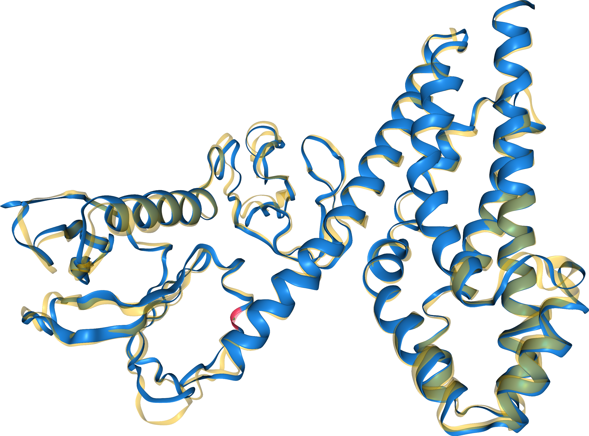
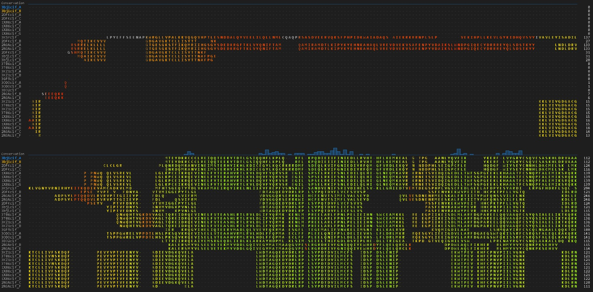
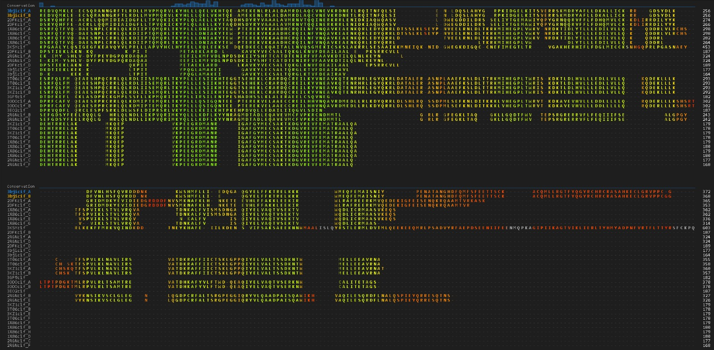
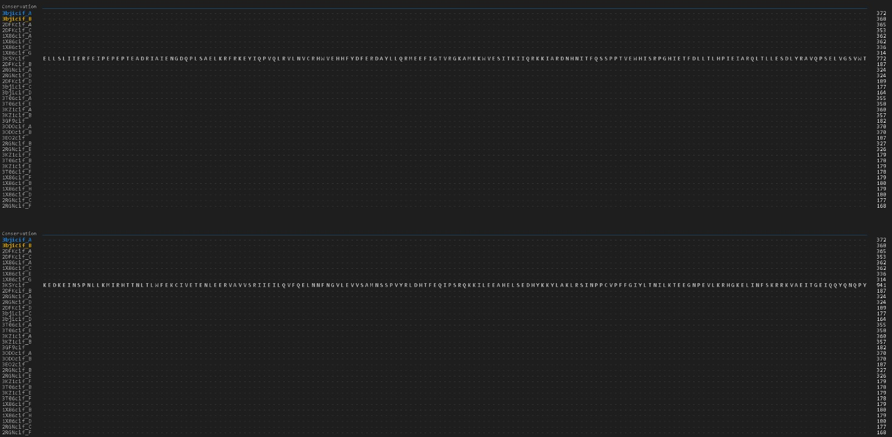

## Superposición estructural de las proteínas 

A la hora de hablar de proteínas es imposible no distinguir su carácter modular; por ello, se parte del hecho de que las proteínas poseen regiones conservadas y funcionales denominadas dominios. Estas regiones se caracterizan por presentar, en muchos casos, homólogos en distintos organismos, ya que constituyen unidades estructurales sometidas a selección natural debido a su relevancia funcional.

Para este ejercicio se empleó la base de datos [CATH: Protein Structure Classification Database at UCL](https://www.cathdb.info/) con el fin de buscar un dominio característico de alguna familia proteica. En este caso, se eligió el dominio proteico SH3. Este dominio es utilizado por las células en procesos de reconocimiento de señales y respuesta celular, permitiendo el ensamblaje de distintos complejos al mediar interacciones proteína-proteína, razón por la cual se encuentra altamente conservado.

Para el análisis estructural se descargaron las estructuras de las siguientes proteínas:
- [1X86](https://www.rcsb.org/structure/1X86)
- [2DFK](https://www.rcsb.org/structure/2DFK)
- [2RGN](https://www.rcsb.org/structure/2RGN)
- [3BJI](https://www.rcsb.org/structure/3BJI)
- [3EO2]([RCSB PDB - 3EO2: Crystal structure of the RhoGEF domain of human neuroepithelial cell-transforming gene 1 protein](https://www.rcsb.org/structure/3EO2))
- [3GF9]([RCSB PDB - 3GF9: Crystal structure of human Intersectin 2 RhoGEF domain](https://www.rcsb.org/structure/3GF9))
- [3KSY]([RCSB PDB - 3KSY: Crystal structure of the Histone domain, DH-PH unit, and catalytic unit of the Ras activator Son of Sevenless (SOS)](https://www.rcsb.org/structure/3KSY))
- [3KZ1]([RCSB PDB - 3KZ1: Crystal Structure of the Complex of PDZ-RhoGEF DH/PH domains with GTP-gamma-S Activated RhoA](https://www.rcsb.org/structure/3KZ1))
- [3ODO]([RCSB PDB - 3ODO: Crystal Structure of the DH/PH Domains of p115-RhoGEF](https://www.rcsb.org/structure/3ODO)
- [3T06]([RCSB PDB - 3T06: Crystal Structure of the DH/PH fragment of PDZRHOGEF with N-terminal regulatory elements in complex with Human RhoA](https://www.rcsb.org/structure/3T06)

### FoldMason

Con estas estructuras en formato PDB o CIF procedimos con su solapamiento estructural a través del software [Foldseek Search Server](https://search.foldseek.com/search). Con este, en su herramienta FoldMason MSA, fuimos capaces de superponer las estructuras de las proteínas.



Fig 1. Superposición de las dos estructuras más cercanas en el arbol guía de FoldMason 

En la figura 1 podemos observar la superposición de las dos primeras proteínas más cercanas en el árbol guía que provee Foldseek. Asimismo, el *LDDT* global de la superposición de las 10 estructuras es de **0.244**, un valor relativamente bajo que también se ve reflejado en el alineamiento de las secuencias, lo que nos da una pauta del porqué del umbral tan bajo de esta métrica de comparación estructural.




Fig 3. Alineamiento multiple de la interfaz de foldseek fasta en `results/foldmason_aa.fa`

En el alineamiento de secuencias múltiples podemos observar cómo las regiones conservadas se localizan principalmente hacia el centro o interior de la secuencia, lo que nos da indicios sobre la ubicación del dominio de interés en una dimensión lineal.

Sin embargo, a pesar de presentar posiciones altamente conservadas, no se puede hablar de una identidad global muy alta. Aun así, el LDDT global no desciende de manera abrupta, lo que también sugiere que la estructura se encuentra más conservada que la secuencia peptídica en sí misma.


### FoldSeek 

Para continuar con el análisis de los dominios, ahora empleamos la herramienta Foldseek ([Foldseek Search Server](https://search.foldseek.com/search)), exportando los resultados previos mediante su interfaz gráfica en línea. Esto con el propósito de buscar estructuras similares a través de la estrategia de _discretizar_ las estructuras que le ingresamos con anterioridad, alfabetizándolas y realizando una búsqueda más rápida.

Particularmente, nos enfocamos en buscar en la base de datos PDB100 no redundante, pues fue la que obtuvo los valores de expectancia más bajos.

| Target | Description | ScientificName | prob | SeqID | E-value | Score | QueryPos | TargetPos |  
|--------|-------------|---------------|------|-------|---------|-------|----------|------------|  
| 3bji-assembly1_A | Structural Basis of Promiscuous Guanine Nucleotide Exchange by the T-Cell Essential Vav1 | Homo sapiens | 1.00 | 100 | 6.15e-61 | 2936 | 1-372 (372) | 1-372 (372) |  
| 2vrw-assembly1_B | Critical structural role for the PH and C1 domains of the Vav1 exchange factor | Mus musculus | 1.00 | 92.9 | 1.18e-53 | 2523 | 2-371 (372) | 1-367 (367) |  
| 6new-assembly1_A | Apo structure of the activated truncation of Vav1 | Homo sapiens | 1.00 | 98.6 | 4.65e-54 | 2514 | 1-372 (372) | 11-387 (389) |  
| 3bji-assembly2_B | Structural Basis of Promiscuous Guanine Nucleotide Exchange by the T-Cell Essential Vav1 | Homo sapiens | 1.00 | 98.3 | 8.90e-53 | 2455 | 1-372 (372) | 1-367 (368) |  
| 6nfa-assembly1_A | Vav1 inhibited by an allosteric inhibitor: Vav1 inhibitors block GEF activity | Homo sapiens | 1.00 | 98.4 | 3.64e-54 | 2377 | 1-372 (372) | 9-385 (386) |  
| 6nf1-assembly1_A | Vav1 inhibited by an allosteric inhibitor: Vav1 inhibitors block GEF activity | Homo sapiens | 1.00 | 99.4 | 1.86e-52 | 2259 | 1-372 (372) | 177-550 (550) |  
| 3ky9-assembly2_B | Autoinhibited Vav1 | Homo sapiens | 1.00 | 97.8 | 3.04e-52 | 2208 | 1-372 (372) | 168-541 (541) |  
| 3ky9-assembly1_A | Autoinhibited Vav1 | Homo sapiens | 1.00 | 99.1 | 2.52e-51 | 2175 | 1-371 (372) | 163-530 (530) |  
| 1f5x-assembly1_A | NMR STRUCTURE OF THE Y174 AUTOINHIBITED DBL HOMOLOGY DOMAIN | Mus musculus | 1.00 | 90.9 | 3.43e-18 | 746 | 1-187 (372) | 22-208 (208) |  
| 5fi0-assembly3_E | Crystal Structure of the P-Rex1 DH/PH tandem in complex with Rac1 | Homo sapiens | 1.00 | 27.4 | 2.99e-17 | 705 | 3-311 (372) | 12-336 (341) | 

Tabla 1. Mejores 10 hits con la herramienta Foldseek con la base de datos PDB100 (ver tabla completa en results/pDB100_header.tsv)


### Otras métricas de similitud estructural 
Por último se analizaron mediante el script `prog3.1_modified.py` las dos primeras estructuras para ver la smiliradidad en cuanto al RMSD. 

```
# total residuos: pdb1 = 372 pdb2 = 336

# total residuos alineados = 299


# coordenadas originales = original.pdb
# superposicion optima:

# archivo PDB = align_fit.pdb
# RMSD = 5.16 Angstrom

# porcentaje de identidad en alineamiento de archivos ./3bjicif_A.pdb y ./1X86cif_E.pdb: 22.07%
```

Con ello podemos observar que la desviación estructural, medida en distancia (Angstrom), es considerable y que el porcentaje de identidad es mucho más bajo, lo que refleja la preferencia por la conservación estructural frente a la conservación de la secuencia. 

### Conclusión 
El análisis estructural, entendido como la superposición de estructuras atómicas, permite evaluar la similitud entre dominios. A partir de ello, podemos comprobar que la conservación a nivel estructural suele ser mayor que a nivel de secuencia, incluso entre un gran número de dominios.

Esto proporciona una aproximación complementaria al análisis de dominios en proteínas al momento de inferir su función, ya que la secuencia puede estar considerablemente degenerada, mientras que la estructura tiende a conservarse. Esta conservación estructural nos ofrece una pauta más robusta para la clasificación y caracterización de distintos péptidos.

