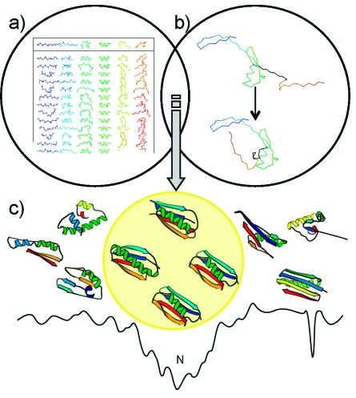
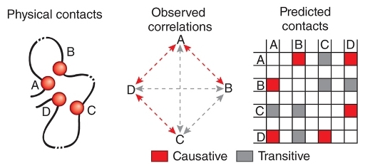
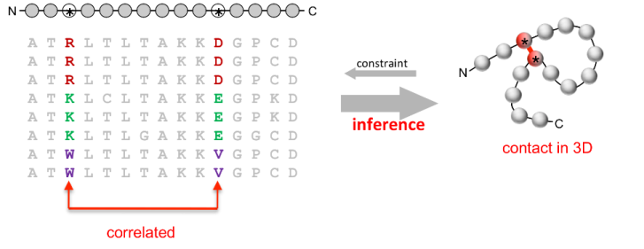
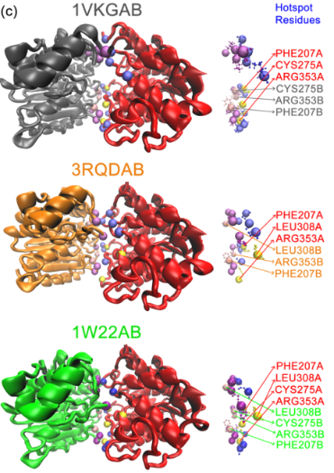
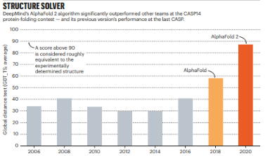
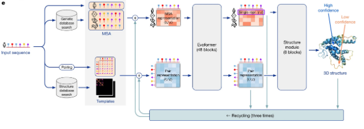
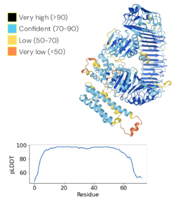

## Protein fold recognition 
Es un problema en el que se tiene una secuencia de una proteína de interés y esta proteina putativa en secuencia no se parece a otras muchas, o si a unas pocas muy raras de las que no se le sabe mucho, en ese supuesto se tiene que explorar la idea de que la **estructura** se encuentra más conservada que la secuencia, por lo que se quiere **saber que función tiene en base a la estructura que no se conoce**.   

-   **PROBLEMA:**  conocemos la secuencia de una proteína, pero desconocemos su tipo de plegamiento y su función
    
-   **SOLUCIÓN PROPUESTA:**  comparar la secuencia con todos los plegamientos conocidos, calcular el grado de parecido/compatibilidad con cada uno de ellos y devolver una lista ordenada

El fold recognition tienen como objeto reconocer a qué tipo de plegamiento (de los conocidos) se debe asignar una secuencia problema, especialmente cuando búsquedas más convencionales con [BLAST](http://blast.ncbi.nlm.nih.gov/Blast.cgi) o [FASTA](http://www.ebi.ac.uk/Tools/fasta/index.html) han fracasado.

## Modelado por homologia
Este modelo se usa para modelar el efecto de de mutaciones puntuales: 

-   **PROBLEMA:**  disponemos de la secuencia de una proteína A y quisiéramos conocer, aunque sea de manera aproximada, su estructura tridimensional
    
-   **SOLUCIÓN PROPUESTA:**  estimar coordenadas cartesianas para la mayoría de los átomos de A, en base a la estructura conocida de proteínas similares, que llamamos plantillas, moldes, o  _templates_ 
Entonces esta estrategia se basa en modelado comparativo mediante dos aproximaciones principales: 

- Ensamblaje de grandes fragmentos rígidos, incluso el plegamiento entero, obtenidos de estructuras similares alineadas por medio de su secuencia primaria y secundaria ([SWISS-MODEL](http://swissmodel.expasy.org/) o [ROBETTA](http://robetta.bakerlab.org/). Esta metodología corta y pega literalmente fragmentos del esqueleto peptídico de estructuras conocidas.
    
- Modelado por satisfacción de restricciones (distancias, ángulos) moleculares extraídas de bases de datos y estructuras similares alineadas ([MODELLER](https://salilab.org/modeller/)). Este método, conceptualmente similar a la resolución por NMR (ver **sección****, produce un conjunto de estructuras para la secuencia A, todas ellas compatibles con las restricciones observadas en los _templates_.

## Ab initio 
Se puede concebir como un hibrido entre fold recognition y modelado por homologia, tratamos de modelar el plegamiento de un polipéptido solamente a partir de su secuencia y de la fı́sica a base de pequeños fragmentos cortados de estructuras conocidas y seleccionados por similitud de secuencia.

Ejemplo [ROBETTA](http://robetta.bakerlab.org/),permite modelar secuencias cortas cuando no hay moldes que alineen con la secuencia problema, ni siquiera por _fold recognition_. Usa fragmentos de 9 aminoácidos de longitud. En este caso podemos definir el problema tipo de esta manera:

 -   **PROBLEMA:**  disponemos de la secuencia de una proteína A y quisiéramos conocer, aunque esa de manera aproximada, su estructura tridimensional
    
-   **SOLUCIÓN PROPUESTA:**  combinar fragmentos tomados de estructuras del PDB, generar conformaciones alternativas y seleccionar las mejores 

## Predicción de contactos 
Columnas de un alineamiento múltiple que se encuentran correlacionadas, es decir que las mutaciones que se encunetran en uno se corresponden con el otro, esto puede ser objeto de una predicción, a partir de los cuales se pueden obtener matrices de contactos con un cierto error, esto se da apartir de estudair la información mutua o información directa dentro de la información del alineamiento multiple.  

### Mutaciones puntuales 
Es un problema muy relevante en el modelado en el que interes se basa en los cambios en la proteina respecto a una estructura nativa. Estas mutaciones puntuales dependen de la estructura y el contexto de la misma, como la ubicación celular o si la misma se asocia en complejos multienzimaticos. Una sustitución en el interior de una hélice no se puede comparar con  o de otro clave para interaccionar con otras proteínas. 

# Alphafold

Nace gracias a la disponibilidad de un gran número de (~10E8) , estructuras (~10E5) y la capacidad de computo. 

### Antecedentes 

CASP, experimento bianual en el que se compartian secuencias no resueltas tridimensionalmente para que se usaran algortimos de predicción para resolver la secuencia. 

Mejoramiento habismal de la aparicion de alphafold en la resolución de estructuras de acuerdo a la metrica GDT_TS. 

## Funcionamiento 

AF2 usa el mismo tipo de información de partida, la secuencia de aminoácidos problema P y un alineamiento múltiple de P con otras secuencias no redundantes de proteínas homólogas, pero va más allá por que en vez de predecir contactos extrae información estructural más concreta cómo distancias y ángulos. Su sistema comprende varios módulos que se ejecutan secuencialmente y realizan las siguientes tareas:

- Extración de correlaciones evolutivas entre residuos de una proteína a partir de perfiles de secuencias homólogas obtenidas con PSIBLAST o HHblits con el algoritmo CCMpred.
    
- Predicción de información estructural con redes neuronales [profundas](https://bioinfoperl.blogspot.com/2020/04/redes-neuronales-profundas.html), con al menos dos variantes:
    
    - Predicción de distancias reales entre C-beta, no contactos, a partir de histogramas precalculados en el rango de 2 a 22 Ansgtrom, inspirado en [RaptorX](https://en.wikipedia.org/wiki/RaptorX). Las distancias estimadas les permiten asignar estructura secundaria con una precisión Q3 del 84% usando datos de CASP11.
        
    - Predicción de ángulos diedros phi y psi (ver sección [1.3.2](https://eead-csic-compbio.github.io/bioinformatica_estructural/#SS)).
        
- Diferenciación del potencial de distancias/ángulos por métodos de minimización de gradientes con la secuencia entera.
    
- Relajación del esqueleto obtenido con el campo de fuerzas AMBER (ver sección [2.6](https://eead-csic-compbio.github.io/bioinformatica_estructural/#DM)), seguido de modelado de cadenas laterales completas con Rosetta, aunque esto no mejore el modelo de manera significativa. 

>En alphafold 3 se le da menos peso a los alineamiento multiples, ademas las estructuras ya no se modelan reisudo a residuo si no que se emplea modelos de difusión que es la que se utiliza para modelar imagenes. 

### Metricas de alphafold

#### PLDDT
Los modelos 3D producidos por AF2 se ordenan por su puntuación **pLDDT** (_predicted Local Distance Difference Test_). Es una predicción por residuo de la función lDDT-Calpha, una medida de confianza para cada residuo basada en el porcentaje de distancias interatómicas que caen dentro de valores esperados. 
>diferencia de lDDT, pLDDT toma valores de 0 a 100 que se guardan como factores de temperatura en los modelos generados en formato PDB 

>lDDT evalúa distancias locales entre átomos vecinos, dentro de un rango de radios, entre un modelo y una estructura de referencia y toma valores en el rango . Un valor alto significa que modelo y referencia se parecen mucho
#### PAE

**PAE** (_Predicted Aligned Error_), que se mide en Amstrongs. Esta métrica mide el error de las posiciones de los residuos de un modelo si se pudiera superponer con la estructura experimental. Se usa sobre todo para evaluar las posiciones de los diferentes dominios de una proteína multidominio. 

>La calidad de prediccion de alpha fold decae mucho sin la existencia de pocos homologos, ya que es la materia prima oara hacer las predicciones  

### Otros algoritmos 
#### - ROSSETA fold 

##### - RFdifuddion2 
Utiliza rossetafold para el diseño de las proteinas, muy utilizado en el apartado de ingenieria de las proteinas .

#### - ESMFold  

## Aplicaciones 

- **Predicción del efecto fenotípico de variantes/SNPs**. Para ellos modelaron 33 proteínas con más de cien mil mutaciones en total resultantes de experimentos de mutagénesis profunda. Tras calcular correlaciones entre los efectos predichos y los medidos experimentalmente observaron que las obtenidas con AF2 eran en promedio iguales o mejores que las obtenidas por métodos experimentales. Otros trabajos más recientes proponen diferentes algoritmos ([Brandes et al. 2023](https://eead-csic-compbio.github.io/bioinformatica_estructural/#ref-Brandes2023); [Cheng et al. 2023](https://eead-csic-compbio.github.io/bioinformatica_estructural/#ref-AlphaMissense2023); [Lacoste et al. 2024](https://eead-csic-compbio.github.io/bioinformatica_estructural/#ref-Lacoste2024)), pero a menudo se centran en proteínas humanas.
    
- **Predicción de cavidades de unión a ligandos**. En este caso usaron un conjunto de 225 proteínas para las cuales había estructuras disponibles en conformación unida al ligando (holo) y también sin unir (apo). En sus manos no apreciaron diferencia entre las cavidades obtenidas experimentalmente y las derivadas de modelos AF2 con **pLDDT > 90**. En cambio, observaron que los modelos AF2 con pLDDT < 90 no son fiables para buscar cavidades. [AlphaFill](https://github.com/PDB-REDO/alphafill) se puede usar para agregar ligandos en esas cavidades.
    
- **Predicción de homo-oligómeros**. En su banco de pruebas observaron que en 71 de 87 casos los modelos de AF2 con el estado correcto de oligomerización tenían la puntuación más alta. Hay otra evaluación más completa em ([Evans et al. 2022](https://eead-csic-compbio.github.io/bioinformatica_estructural/#ref-Evans2021)).
    
- **Reemplazamiento molecular**. Con dos ejemplos mostraron que los modelos AF2 se pueden usar para refinar modelos obtenidos datos experimentales de cryo-EM y cristalográficos.
    

Otras aplicaciones son:

- **Diseño de proteínas con función a la carta**, como se explica por ejemplo en ([Madani et al. 2023](https://eead-csic-compbio.github.io/bioinformatica_estructural/#ref-ProGen2023); [A. B. Guo et al. 2025](https://eead-csic-compbio.github.io/bioinformatica_estructural/#ref-Guo2025))
    
- **Predicción de sitios activos**, como se explica por ejemplo en ([Tang and Wang 2025](https://eead-csic-compbio.github.io/bioinformatica_estructural/#ref-Tang2025))
    
- **Predicción de interacciones entre proteínas**, por ejemplo con [proteínas de defensa de plantas](https://bioinfoperl.blogspot.com/2024/09/protocolo-parejas-proteinas%20con%20AlphaFold.html) y o en interfaces mediadas por proteínas desordenadas ([Homma, Huang, and Hoorn 2023](https://eead-csic-compbio.github.io/bioinformatica_estructural/#ref-Homma2023); [Homma, Lyu, and Hoorn 2024](https://eead-csic-compbio.github.io/bioinformatica_estructural/#ref-Homma2024); [Ginell et al. 2025](https://eead-csic-compbio.github.io/bioinformatica_estructural/#ref-Ginell2025); [Varga, Ovchinnikov, and Schueler-Furman 2025](https://eead-csic-compbio.github.io/bioinformatica_estructural/#ref-Varga2025))
    
- **Predicción de complejos proteína-ADN**, como se explica por ejemplo en ([Gerasimavicius, Biddie, and Marsh 2026](https://eead-csic-compbio.github.io/bioinformatica_estructural/#ref-Gerasimavicius2026)) 

### Jupiter para modelamiento de estructuras 
[AlphaFold2.ipynb - Colab](https://colab.research.google.com/github/sokrypton/ColabFold/blob/main/AlphaFold2.ipynb#scrollTo=kOblAo-xetgx)

[OpenFold.ipynb - Colab](https://colab.research.google.com/github/aqlaboratory/openfold/blob/main/notebooks/OpenFold.ipynb#scrollTo=woIxeCPygt7K) 
