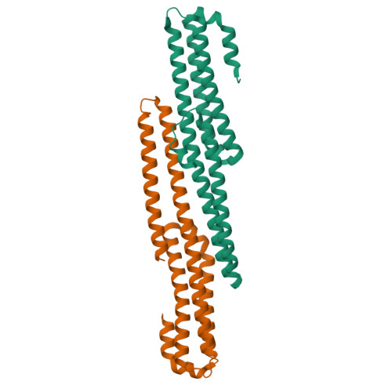
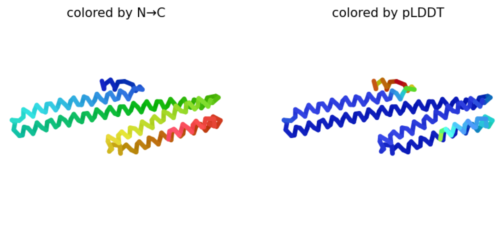
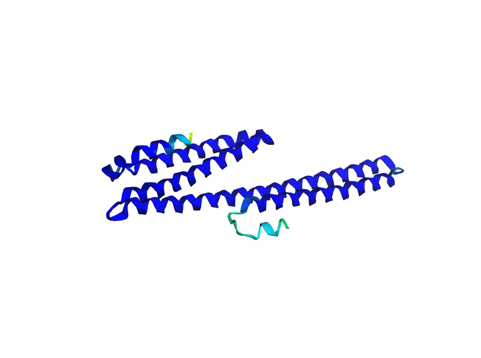
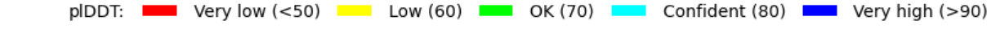
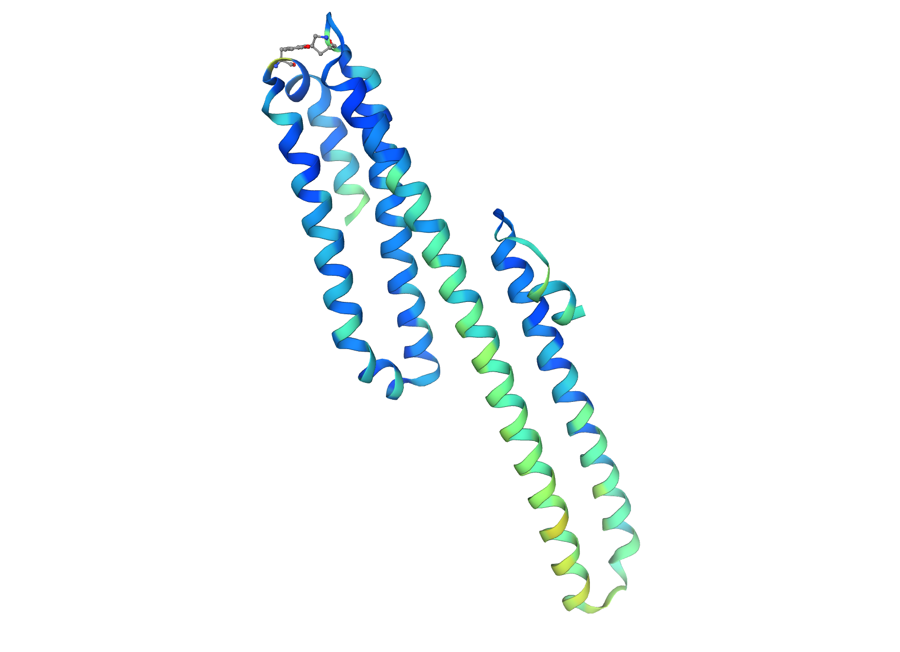
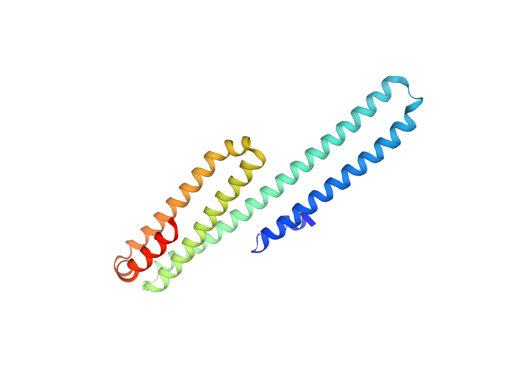
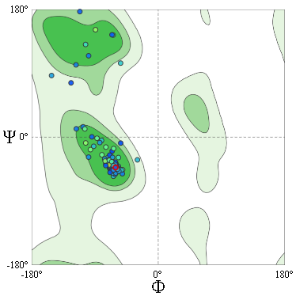

## Modelamiento de una estructura a partir de la secuencia peptídica

Para este ejercicio se utilizarán distintos algoritmos de modelamiento de proteínas a partir de su secuencia con el fin de comparar la resolución de los mismos mediante métricas como el pLDDT.

Para este ejercicio se seleccionó una proteína del PDB de interés con el objetivo de comparar la estructura reportada con la predicha por algoritmos como AlphaFold2.

## 5TPT

### Estructura reportada

Esta es una proteína con estructura cristalográfica reportada en el PDB [RCSB PDB - 5TPT: The Crystal Structure of Amyloid Precursor-Like Protein 2 (APLP2) E2 Domain](https://www.rcsb.org/structure/5TPT) y corresponde al dominio E2 de la proteína precursora amiloidea, la cual está involucrada en la supervivencia, adhesión celular, desarrollo neuronal y enfermedades como el Alzheimer.  
  
Fig 1. Estructura cristalográfica de la proteína 5TPT

### Predicción

Mediante el algoritmo de AlphaFold2 disponible en [AlphaFold2.ipynb - Colab](https://colab.research.google.com/github/sokrypton/ColabFold/blob/main/AlphaFold2.ipynb#scrollTo=AzIKiDiCaHAn) utilizamos la secuencia `DVDVYFETSADDNEHARFQKAKEQLEIRHRNRMDRVKKEWEEAELQAKNLPKAERQTLIQHFQAMVKALEKEAASEKQQLVETHLARVEAMLNDRRRMALENYLAALQSDPPRPHRILQALRRYVRAENKDRLHTIRHYQHVLAVDPEKAAQMKSQVMTHLHVIEERRNQSLSLLYKVPYVAQEIQEEIDELLQEQR` para realizar la predicción con los siguientes parámetros:

- num_relax = 0
    
- template mode = none
    
- msa_mode = mmseqs2_uniref_env
    
- pair_mode = unpaired_paired
    
- model type = auto (en el caso de este monómero == alphafold2_ptm)
    
- recycle_early_stop_tolerance = auto (para el tipo de modelo --> num_recycles = 20)
    
- relax_max_iterations = 200
    
- pairing_strategy = greedy
    
- max_msa = auto
    
- num_seeds = 1
    

#### Resultado de la última iteración

  
Fig 2. Última iteración (005) de la predicción AlphaFold2

#### Estructura 3D

  
Fig 3. Estructura final predicha por el algoritmo, nuevamente coloreada por el pLDDT

  
Fig 4. Escala de color de la calificación por pLDDT

### Comparación

Una vez realizadas estas predicciones, podemos proceder a comparar las estructuras mediante el script previamente utilizado `prog3.1_modified.py` (ruta relativa del repositorio /Dia2/src/prog3.1_modified.py).

```
# total residuos: pdb1 = 197 pdb2 = 197  
  
# total residuos alineados = 197  
  
# coordenadas originales = original.pdb  
# superposición óptima:  
  
# archivo PDB = align_fit.pdb  
# RMSD = 1.27 Angstrom  
  
# porcentaje de identidad en alineamiento de archivos ../../Dia3/data/5TPT.pdb y ../../Dia3/data/5TPT_pred_lstItr.pdb: 100.00%
```


### Comparación en base a otras métricas

Para completar el análisis realizado se utilizó la herramienta de [swissmodel](https://swissmodel.expasy.org/assess/85LJQe/01), con el objetivo de obtener métricas de similitud basadas en la estructura como el TM-score y el RMSD, y otras independientes de la superposición estructural como el IDDT.

|Medida|Valor|
|---|---|
|IDDT|0.38|
|TM-score|0.51|
|RMSD|1.11|

  
Fig 5. Solapamiento entre la estructura cristalográfica y la predicha, coloreada por el IDDT

### Swissmodel

Posteriormente procedimos a analizar las estructuras mediante Swiss-Model [SWISS-MODEL](https://swissmodel.expasy.org/). Esto nos permite analizar la información estructural de nuestra predicción `5TPT_pred_lstItr.pdb` con las estructuras en UniProt [5TPT_pred_lstItr.pdb | Structure Assessment](https://swissmodel.expasy.org/assess/J3C9rw/01).

  
Fig 6. Estructura coloreada en Swiss-Model a partir de la predicha `5TPT_pred_lstItr.pdb`

Asimismo, mediante esta interfaz podemos observar el Ramachandran plot de nuestra estructura.

  
Fig 7. Ramachandran plot de la estructura predicha de 5TPT

Gracias al Ramachandran plot podemos observar cómo se distribuyen los ángulos $\psi$ y $\phi$ de la estructura modelada por AlphaFold2. Este análisis es relevante porque permite identificar las estructuras secundarias que se forman, como $\alpha$ hélices y láminas $\beta$ plegadas. Como se puede observar —y como anticipaba la métrica de pLDDT predicha por AF2— nuestra estructura presenta una buena agrupación dentro de las zonas verdes, que corresponden a regiones favorables para la formación de estas estructuras secundarias. Esto indica que nuestra predicción tiene sentido estructural y robustez de acuerdo con este tipo de conformaciones.

![[QMEANDisCo.png.png]]  
Fig 8. Estadísticas relacionadas con QMEANDisCo

La estadística QMEANDisCo (Qualitative Model Energy ANalysis with Distance Constraints) nos permite evaluar propiedades físicas de la resolución de nuestra estructura comparándolas con valores teóricos esperados. Mediante esta métrica podemos estimar qué tan adecuado es nuestro modelo desde el punto de vista físico. El QMEANDisCo global de nuestro modelado es `0.78`, lo cual corresponde a un modelo de buena calidad y concuerda con la evidencia presentada hasta el momento.

Por último, es relevante comentar que, al evaluar esta proteína predicha frente a aquellas reportadas en UniProt, encontramos el mejor hit con la proteína _Rhinopithecus roxellana (Golden snub-nosed monkey)_ Amyloid beta precursor-like protein 2, la cual tiene una función similar en un organismo filogenéticamente cercano. Es interesante destacar que esta también fue predicha por AlphaFold.

### Conclusión

Los algoritmos de predicción estructural utilizan distintas aproximaciones para resolver la estructura tridimensional a partir de la secuencia primaria. Dentro de este procedimiento se busca homología entre secuencias para inferir posibles estructuras putativas con base en similitud evolutiva o en la inferencia de contactos por correlaciones entre posiciones. En particular, AlphaFold2 parte de alineamientos múltiples para obtener información coevolutiva entre secuencias con el objetivo de predecir distancias, contactos y ángulos.

Como algoritmo de aprendizaje automático basado en redes neuronales profundas, predice distancias entre carbonos $\beta$ y ángulos $\psi$ y $\phi$ de la secuencia proteica; posteriormente realiza la minimización por gradiente y la relajación del esqueleto proteico, así como el refinamiento de las cadenas laterales.

Dado que este método se basa en información registrada en bases de datos estructurales de referencia, la predicción de una secuencia que ya cuenta con una estructura cristalográfica registrada presenta mayor confianza. Esto se refleja en su alto pLDDT y en la alta similitud con la estructura de referencia obtenida en el PDB, con una ligera disminución en el IDDT atribuible a pequeños choques estéricos ubicados en las regiones externas de las $\alpha$ hélices. Esto se ve respaldado por la buena distribución de los residuos de la proteína predicha en el Ramachandran plot y por el valor global elevado de QMEANDisCo, lo cual refuerza la confiabilidad de nuestra predicción.
