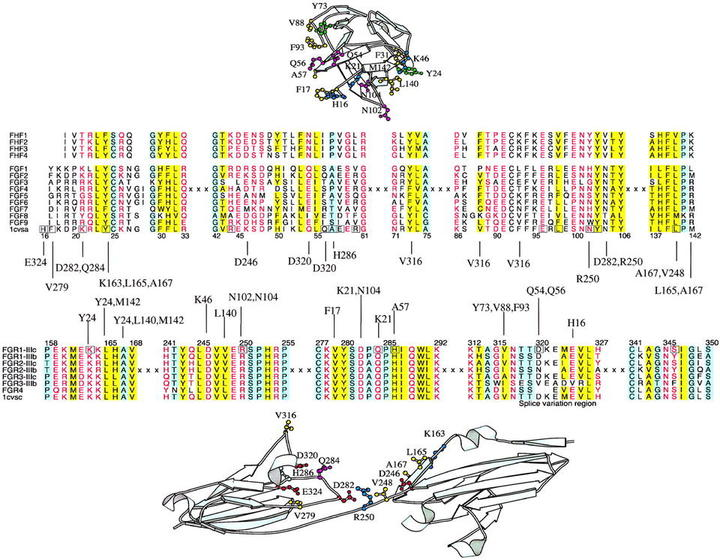
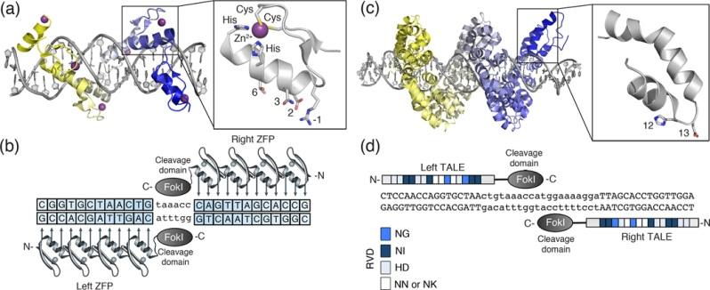
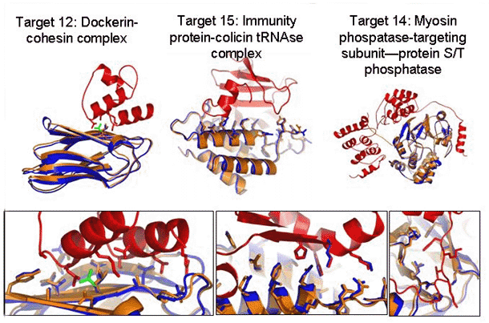
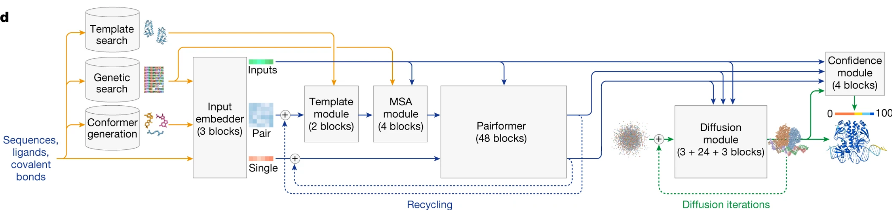

## Estructura cuaternaria 
Es propio de la cualidad de las interfaces moleculares que se pueden formar entre biomoléculas como las como las proteínas, proteína-DNA, la estructura cuaternaria donde unas moléculas interaccionan con otras para llevar a cabo funciones importantes en el contexto celular.  

Una aproximación para predecir las interacciones entre proteínas es parecida a la que se aplica en el algoritmo de predicción por contactos en las que se evalúan las columnas de los alineamientos múltiples que se correlacionan, es decir que cambian en función del otro para adaptarse en el contacto que existe. 

## Algoritmos de predicción

### Optimización de cadenas laterales  
En ocasiones podemos asumir que el esqueleto peptídico de una proteína no va a variar mucho al cambiar su secuencia, en particular cuando la similitud global de secuencia es alta. Si se cumple esta condición es posible tratar de optimizar una secuencia de aminoácidos con el fin de modificar su estabilidad, su actividad enzimática o su especificidad. 

>Asumes que el resto de la interfaz no está variando  

### Interacciones no covalentes (puentes de hidrogeno en la interfaz) 
Las interacciones "débiles" son aquellas que median la interacción entre proteínas u proteínas y otras biomoléculas éste es un proceso termodinámico complejo, donde se conjugan afinidades y especificidades, pero en muchas ocasiones los protagonistas son los puentes de hidrógeno de la interfaz, que naturalmente dependen de la secuencia o estructura primaria, puesto que no todos los aminoácidos pueden actuar como donadores o aceptores, demás de muestrear es necesario evaluar la especificidad del reconocimiento de las interfaces modeladas, por ejemplo estimando la formación de puentes de hidrógeno.

### Interfaz entre proteína, DNA y RNA: endonucleasas CRISPR-Cas guiadas por RNA 

El principal objetivo es comprender las herramientas de edición genómica como el sistema CRISPR, TALEN o zinc fingers

Estos sistemas se han usado, por ejemplo, para inducir mutaciones heredables en loci seleccionados de plantas, incluso en especies poliploides como el trigo panadero ([Y. Wang et al. 2014](https://eead-csic-compbio.github.io/bioinformatica_estructural/#ref-Wang2014); [Lawrenson et al. 2015](https://eead-csic-compbio.github.io/bioinformatica_estructural/#ref-Lawrenson2015)). Para ello es preciso hacer análisis de secuencias con el fin de elegir las secuencias adecuadas, normalmente únicas en el genoma. En el caso de las endonucleasas Cas ([Stella, Alcon, and Montoya 2017](https://eead-csic-compbio.github.io/bioinformatica_estructural/#ref-Stella2017)), polipéptidos de más de 1000 aminoácidos, las secuencias diana deben elegirse respetando la arquitectura de la interfaz entre proteína, DNA y RNA, que requiere un motivo de entre 3 y 5b adyacente a la diana, llamado PAM (_protospacer adjacent motif_). Además de la estructura de estos complejos, normalmente es necesario determinar experimentalmente _in vitro_ e _in vivo_ la tasa de cortes no deseados o qué partes del RNA guía (sgRNA) son más sensibles en la hibridación ([Cisse, Kim, and Ha 2012](https://eead-csic-compbio.github.io/bioinformatica_estructural/#ref-Cisse2012); [T. Zheng et al. 2017](https://eead-csic-compbio.github.io/bioinformatica_estructural/#ref-Zheng2017)). Se han empleado asimismo modelos de dinámica molecular para estudiar la mecánica de estos complejos ([W. Zheng 2017](https://eead-csic-compbio.github.io/bioinformatica_estructural/#ref-Zheng2017w)). 

### Modelaje por homología  
Se usa una estructura molde usada como punto de referencia algunos algoritmos no cambian la estructura molde a modelar pero otros más sofisticados para ajustar el acoplamiento por docking.  
Podemos aprovechar la homología para estudiar u optimizar una interfaz molecular en base a la estructura de otras moléculas similares.

Hay muchas herramientas disponibles para modelar interfaces entre proteínas, desde herramientas sencillas como [InterPreTS](http://www.russelllab.org/cgi-bin/tools/interprets.pl) o [PPI3D](http://bioinformatics.ibt.lt/ppi3d), que no cambian la geometría de la estructura molde usada como punto de apoyo, a protocolos más complejos que ajustan el acoplamiento por _docking_. Hay también herramientas especializadas en el estudio de interfaces en el contexto de enfermedades asociadas a mutaciones ([InteractomeINSIDER](http://interactomeinsider.yulab.org/)) o en el diseño de anticuerpos ([Lapidoth et al. 2015](https://eead-csic-compbio.github.io/bioinformatica_estructural/#ref-Lapidoth2015); [Baran et al. 2017](https://eead-csic-compbio.github.io/bioinformatica_estructural/#ref-Baran2017)).
### Docking 
 Cuando no disponemos de estructuras de referencia, el estudio de las conformaciones que adoptan las macromoléculas cuando interaccionan de forma transitoria es aun más difícil, con costes computacionales poco asumibles. La razón de esto es que hay muchos grados de libertad y un gran número de átomos del sistema pueden moverse. Por tanto, los algoritmos de docking suelen emplear estrategias para ahorrar recursos, como por ejemplo el uso de transformadas de Fourier en vez del empleo explícito de matrices de rotación y traslación.  
Como resultado de las simulaciones de _docking_ tendremos una serie de complejos, que pueden o no mostrar interfaces relevantes en términos biológicos, dependiendo de la profundidad del muestreo realizado y el análisis posterior de los resultados, que obviamente requiere de cierta experiencia y sobre todo conocimiento de las moléculas implicadas.

### Alpha fold 3 
Usa un modelo de difusión usados por IAs generativas a partir de textos, gracias al entrenamiento con todas las moleculas en interacción en bases de datos AF3 es capaz de generar imagenes a tarves de texto que en este caso son secuencias, esto lo hace mediante iteraciones de difusión en la que en cada ciclo va mejorando mediante añadir puntos a la estructura predicha (creación de nubes de puntos).

