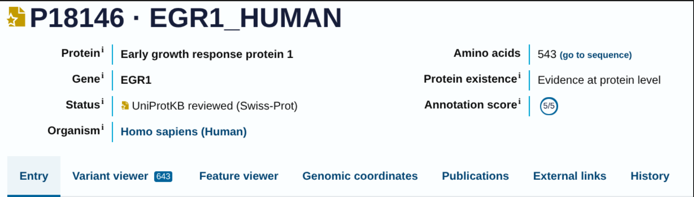
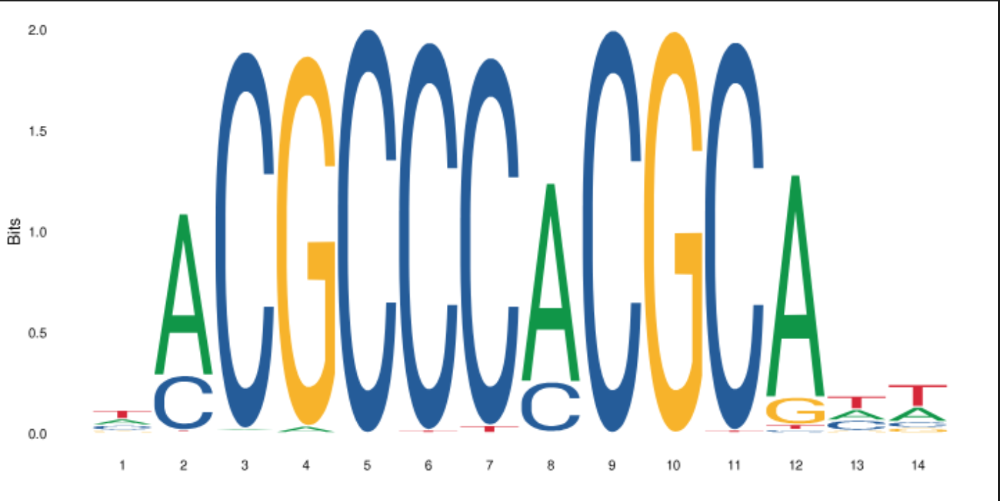
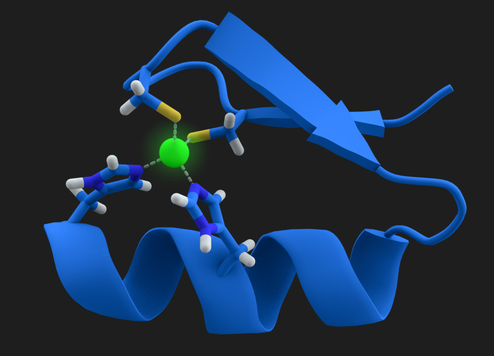
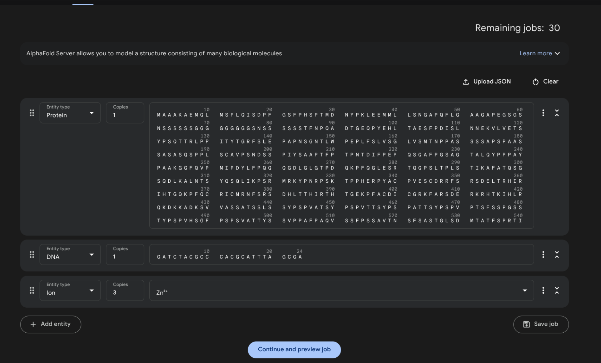
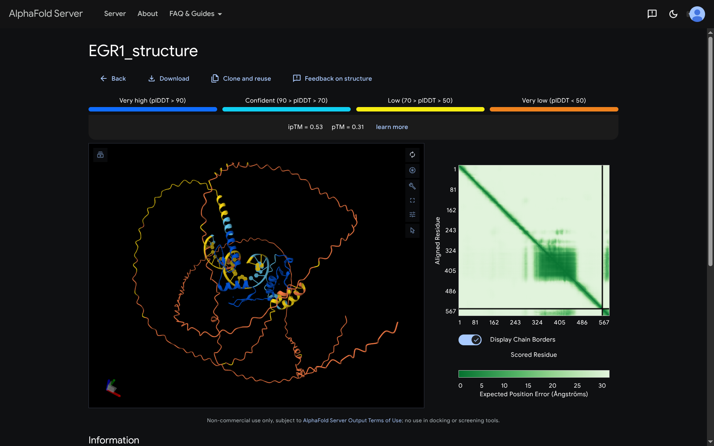
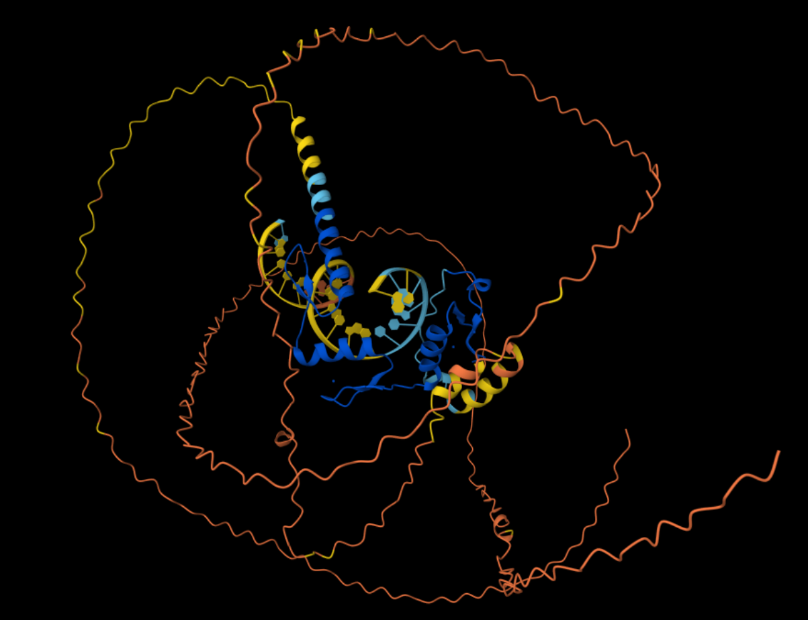
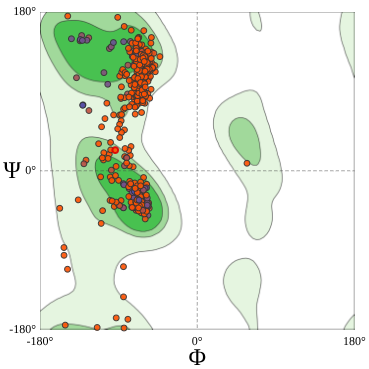
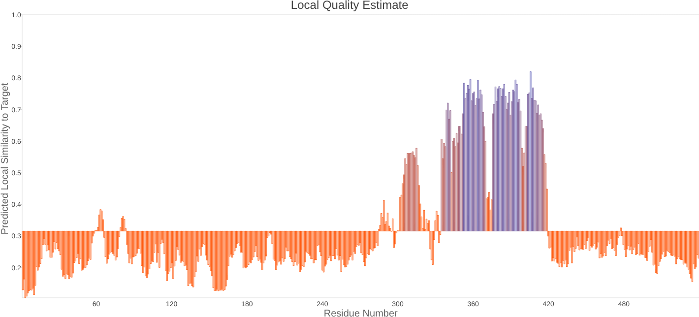
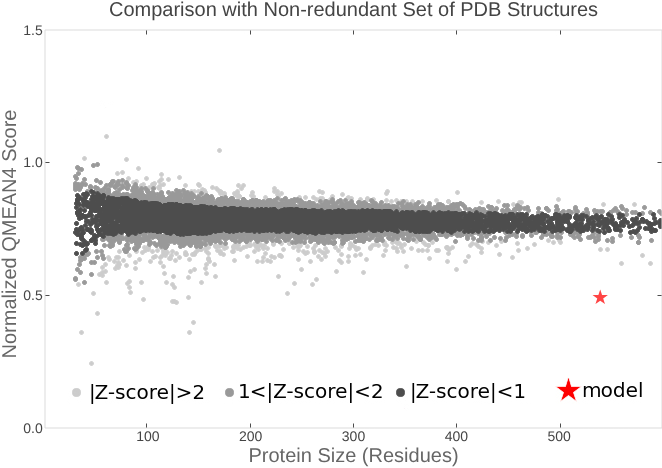
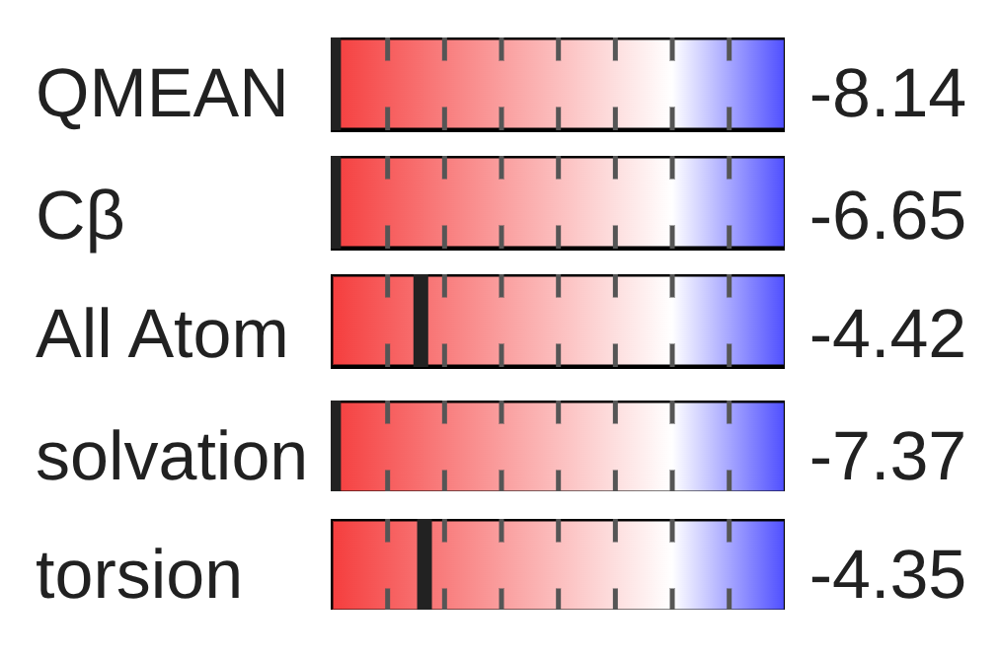

### 7.7.2 Ejercicio con AF3[](https://eead-csic-compbio.github.io/bioinformatica_estructural/#ejercicio-con-af3)

En esta sección se trata de modelar un complejo proteína-ADN con AF3. Para ello necesitarás:

- la secuencia de aminoácidos de un factor de transcripción; si es un dímero necesitarás dos secuencias
    
- la secuencia de ADN (20-30 pares de bases) que contenga un sitio conocido o esperado de unión del factor de transcripción
    
- si conoces iones necesarios para la unión, como Zn, puedes incluirlos también
    
- lanzar la predicción en [https://alphafoldserver.com](https://alphafoldserver.com/)
    
- estimar su calidad con las distintas métricas y [https://swissmodel.expasy.org/assess](https://swissmodel.expasy.org/assess)
    
- opcionalmente puedes estudiar la especificidad del complejo obtenido como se explica en el [blog](https://bioinfoperl.blogspot.com/2024/05/logo-protein-DNA-complex-alphafold.html)

---

## TF

Decidimos usar el *TF* **EGR1**
- De *Homo sapiens*
- C2H2 Zinc finger
	- 3 dedos de zinc en tándem
- Monómero

### Secuencia de aminoácidos

Para recuperar la secuencia del TF hicimos una búsqueda en [UniProt](https://www.uniprot.org/uniprotkb/P18146/entry); go to secuence; *FASTA* download


> TF de interés en UniProt

> Function
*Transcriptional regulator (PubMed:[20121949](https://www.uniprot.org/citations/20121949)).  
Recognizes and binds to the DNA sequence 5'-GCG(T/G)GGGCG-3'(EGR-site) in the promoter region of target genes (By similarity).  
Binds double-stranded target DNA, irrespective of the cytosine methylation status (PubMed:[25258363](https://www.uniprot.org/citations/25258363), PubMed:[25999311](https://www.uniprot.org/citations/25999311)).  
Regulates the transcription of numerous target genes, and thereby plays an important role in regulating the response to growth factors, DNA damage, and ischemia. Plays a role in the regulation of cell survival, proliferation and cell death. Activates expression of p53/TP53 and TGFB1, and thereby helps prevent tumor formation. Required for normal progress through mitosis and normal proliferation of hepatocytes after partial hepatectomy. Mediates responses to ischemia and hypoxia; regulates the expression of proteins such as IL1B and CXCL2 that are involved in inflammatory processes and development of tissue damage after ischemia. Regulates biosynthesis of luteinizing hormone (LHB) in the pituitary (By similarity).  
Regulates the amplitude of the expression rhythms of clock genes: BMAL1, PER2 and NR1D1 in the liver via the activation of PER1 (clock repressor) transcription. Regulates the rhythmic expression of core-clock gene BMAL1 in the suprachiasmatic nucleus (SCN) (By similarity).*

### Secuencia de DNA 
> 20-30 nt

Después buscamos el TF desde [JASPAR](https://jaspar.elixir.no/matrix/MA0162.2/), entramos al *matrix ID* MA0162.3 y descargamos su respectivo logo, con el *conensus* extendio (14 *bp*s) `TACGCCCACGCATT`



Añadiendo a esta secuencia `GATC` en el extremo 5' y `TAGCGA` en el 3':

> Secuencia


```
GATCTACGCCCACGCATTTAGCGA
```


### Iones necesarios

Dado que **EGR1** posee 3 dedos de zinc en tándem, 3 iones Zn$^{2+}$ son estructuralmente necesarios.



### Predicción con *AlphaFold3*



Después de correr el modelo se obtuvo:




Este resultado es satisfactorio pues:
- *Dedos de zinc* en azul (pIDDT > 90)
- Resto flexible
- *PAE* (Predicted Aligned Error) *plot* recupera ese dominio de zinc finger (posiciones ~300-420)
- Otras regiones desordenadas (flexibles)

Así, se descargó el `.zip` y se descomprimió para obtener los modelos `.cif` y los archivos `.json` correspondientes.

Archivos `.cif`

```
fold_egr1_structure_model_0.cif  fold_egr1_structure_model_1.cif  fold_egr1_structure_model_2.cif  fold_egr1_structure_model_3.cif  fold_egr1_structure_model_4.cif
```

donde el 0 es el modelo (de las iteraciones) que obtuvo el mejor ranking $\rightarrow$ `fold_egr1_structure_model_0.cif`

Archivos `.json`

```
fold_egr1_structure_full_data_0.json  fold_egr1_structure_full_data_3.json  fold_egr1_structure_summary_confidences_0.json  fold_egr1_structure_summary_confidences_3.json
fold_egr1_structure_full_data_1.json  fold_egr1_structure_full_data_4.json  fold_egr1_structure_summary_confidences_1.json  fold_egr1_structure_summary_confidences_4.json
fold_egr1_structure_full_data_2.json  fold_egr1_structure_job_request.json  fold_egr1_structure_summary_confidences_2.json
```



> Modelo con dedos de zinc

### Calidad del modelo

En [*Swissmodel*](https://swissmodel.expasy.org); *Tools*; *Structure Assessment* cargamos el modelo `fold_egr1_structure_model_0.cif` para hacer la búsqueda de la secuencia en *UniProt* (>90% sequence identity). Obtuvimos los siguientes [resultados](https://swissmodel.expasy.org/assess/Qlgb6V/01):



Observamos la distribución general de los residuos según los ángulos $\phi$ y $\psi$, lo que nos permite ver la concentración de residuos formando láminas $\beta$, mayormente paralelas, así como algunas triple hélices de colágeno. Asimismo, vemos varias $\alpha$ hélices dextrógiras mientras que se alcanza a visualizar apenas una levógira.







| Métrica                          | Valor                   | Qué evalúa                                                                                      |
| -------------------------------- | ----------------------- | ----------------------------------------------------------------------------------------------- |
| **Ramachandran Plot (Favoured)** | 70.63% (4.65% outliers) | Distribución de los ángulos $\phi$ y $\psi$ del esqueleto peptídico y calidad geométrica global |
| **MolProbity Score**             | 2.55                    | Calidad estereoquímica global del modelo                                                        |
| **Clashscore**                   | 7.87                    | Número de choques estéricos severos por cada 1000 átomos                                        |
| **QMEANDisCo**                   | 0.32 +/- 0.05           | Estimación global de calidad estructural comparada con estructuras experimentales de referencia |

> Métricas graficadas

Los resultados muestran una calidad estructural aceptable con pocos conflictos atómicos, aunque con una proporción considerable de residuos fuera de las regiones favorecidas del Ramachandran plot. El QMEAN es moderado, lo que sugiere que la confianza varía a lo largo de la secuencia, probablemente debido a regiones intrínsecamente desordenadas, que identificamos precisamente como una de las características de *TF*s como EGR1. En conjunto, consideramos que el modelo es adecuado para análisis estructurales generales y para estudiar dominios funcionales. Aún así, las regiones de baja confianza nos dicen que debemos interpretarlo con mesura.
### Conclusión

El ejercicio nos permitió modelar *in silico* la estructura de la proteína EGR1 de *Homo sapiens* a partir de la AlphaFold Protein Structure Database, obteniendo el archivo estructural en formato mmCIF, que nos permitió su posterior análisis. El modelo fue evaluado mediante herramientas de validación estructural disponibles en SWISS-MODEL, incluyendo diferentes análisis *estereoquímicos* (Ramachandran plot, MolProbity score y *clashscore*) y una evaluación global de calidad mediante QMEANDisCo. Asimismo, el hecho de tener interacciones proteína-DNA con presencia de iones metálicos nos hizo notar que las proteínas no funcionan de forma aislada, sino como parte de complejos moleculares y, siendo un *TF*, evidenciando la base de la regulación génica.
